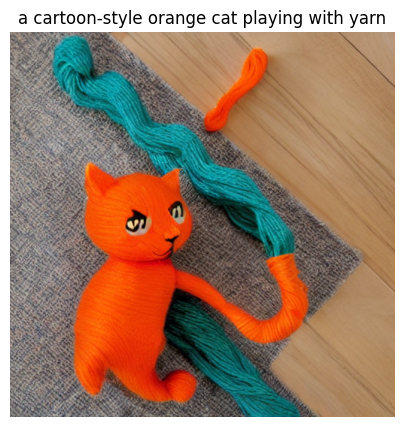
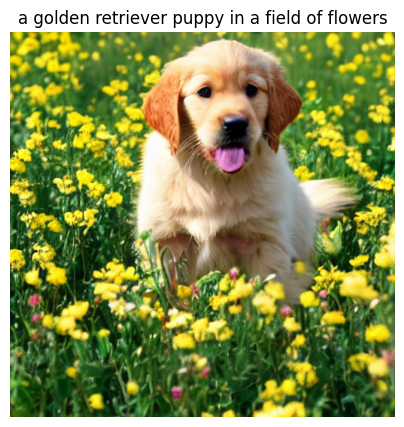
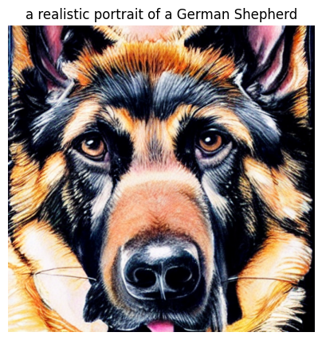
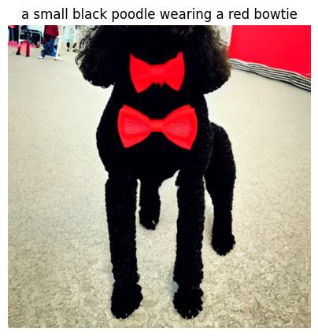
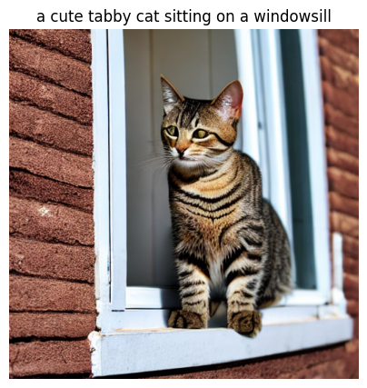
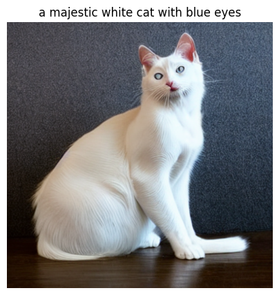

# CLIP-Guided Image Generation

Text-to-image generation pipeline that combines **Stable Diffusion** (image generation) with **CLIP** (image-text matching) to automatically pick the best-matching image for a given prompt.

## What it does

1. Takes a text prompt (e.g. *"a majestic white cat with blue eyes"*)
2. Generates candidate images using Stable Diffusion
3. Uses CLIP to score how well each generated image matches the original prompt
4. Returns the highest-scoring image

This ranking step is the key idea: rather than accepting the first image a diffusion model produces, the pipeline generates multiple candidates and lets a second model (CLIP) judge which one best matches the intent — a technique used in real production image-generation systems.

## Example outputs

## Tech stack

- Python
- PyTorch
- OpenAI CLIP (ViT-B/32)
- Stable Diffusion (via Hugging Face `diffusers`)
- Google Colab (GPU runtime)

## How to run

Open `clip_guided_image_generation.ipynb` in Google Colab, set the runtime to GPU (Runtime → Change runtime type → GPU), and run all cells in order.

## Author

Shittu Adedayo Micheal
